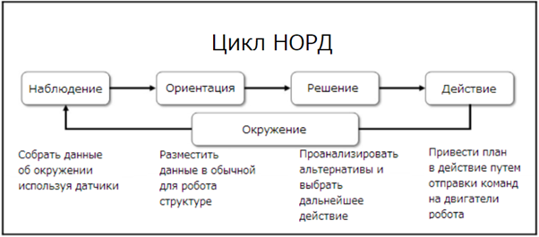

# 1.3.4 Чему Вы научитесь

Не все главы или темы в этой книге можно считать _классическим_ подходом к ИИ, но все они представляют собой различные пути и подходы к ИИ и принятию решений.

Построение основы для управления роботом начнём с понимания теории управления и времени. Мы будем использовать систему слабого управления в реальном времени с покадровым управляющим циклом. У этой техники фантастическое название, но, я думаю, сам её концепт достаточно интуитивен и прост для понимания.

На самом базовом уровне, ИИ - это способ для робота принимать решения относительно своих действий. Мы введём модель принятия решений, начавшую свой путь в ВВС США, называющуюся циклом НОРД \(Наблюдение-Ориентация-Решение-Действие\). У нашего робота будет два таких цикла: внутренний и внешний. Внутренний будет иметь приоритет над внешний, прямо как автономные части Вашего тела имеют приоритет над остальными. В _Главе 2, Подготавливаем Робота_, это отнесёт нашу систему к архитектуре потребления, управляющей парадигме, основанной на биологии, разработанной Родни Брукс из MIT, одним из основателей iRobot и разработчиком робота Baxter.

**Цикл НОРД** был разработан Джоном Бойдом, человеком, так же известным, как _Отец F-16_. На сегодняшний день его идеи широко цитируются, а его цикл НОРД используется для описания искусственного интеллекта роботов, военного планирования, стратегий маркетинга и т.д. Цикл НОРД представляет модель того, как думающая машина, взаимодействующая с окружением, может работать.

Наш робот работает не просто выполняя команды или следуя инструкции шаг за шагом, но устанавливая себе цели, а позже работая над их достижением. Робот может сам установить себе путь или определить, как достичь заданной цели. Мы скажем роботу _поднять игрушку_, и он сам решит, какую именно, как к ней подобраться, как поднять. Если бы мы, люди, пытались управлять роботом как механической рукой, нам бы пришлось дать ему огромное количество команд - двигаться вперёд, двигаться направо, вытянуть руку, раскрыть руку, - каждую команду по отдельности, не сообщая роботу, зачем же мы проводим все эти манипуляции.

Перед разработкой робота и его ПО нам надо сравнить его возможности со средой и задачей, которую ему необходимо решить. Эта книга введет некоторые способы разработки и управления разработкой ПО. Для этого мы будем использовать две вещи из дисциплины системного проектирования - сценарии использования и раскадровки. Я попытаюсь рационализировать этот процесс настолько, насколько это возможно.

