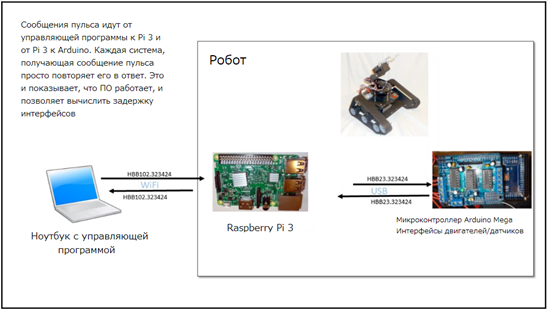

# 1.3.9 Система управления роботом - управляющий цикл с мягким реальным временем

Теперь, когда мы немножко потренировались с программированием, мы можем применить наши знания в управляющем цикле нашего робота. У управляющего цикла есть две основные функции:

* Реагировать на команды от управляющей станции
* Служить интерфейсом двигателей робота и датчиков в Arduino Mega

Мы будем использовать стандартный формат отправки команд роботу. Все команды имеют трёхбуквенный идентификатор, определяющий команду. Мы будем использовать “DRV” для команд двигателям, “ARM” для команд руке, “TLn” для данных телеметрии, где “n” - это число или буква, позволяющие нам создать несколько списков телеметрии для различных целей. Сообщения об ошибке будут начинаться на “ERR”, остальные команды на “COM”. Тогда сообщение о телеметрии двигателей может выглядеть как-то так:

`TL11500,1438\n`

Здесь `TL1` - идентификатор \(список телеметрии 1\), а данные разделены запятыми. В нашем случае, две цифры - это данные состояния правого и левого двигателей соответственно. `\n` указывает на _конец строки_ в Python и обозначает конец сообщения.

Теперь мы добавим одну особенность, которая всегда имеется в моих роботах и беспилотных машинах. Всегда важно поддерживать контроль над роботом. Мы хотим избежать ситуаций, когда аппаратный сбой или ошибка ПО приведёт к потере контроля над роботом. Поэтому мы будем обнаруживать ошибки с помощью пульса. **Пульс** — это обычное сообщение, которые время от времени пересылается от управляющей станции к мозгу робота, микроконтроллеру и обратно. Мы будет хранить в пульсе время его отправки для определения задержки. **Задержка** - это период времени между отправкой команды и реакцией робота на неё. Если пульс нарушится, мы сможем определить, что процесс сломался и остановим движение робота, при этом послав оператору сообщение об ошибке.

Этот робот, как и большинство моих творений, был разработан для автономной работы большую часть времени, и поэтому не нуждается в связи с управляющей станцией. Вы можете прочитать логи робота, послать какие-либо команды, поуправлять им как радиоуправляемой машиной и снова перевести его в автономный режим. Так что нам надо разработать пульс таким образом, чтобы ему не требовалась управляющая станция, но при этом чтобы он начинал посылаться сразу при подключении к ней.

Дважды в секунду главный компьютер, Raspberry Pi3, будет посылать сообщение с идентификатором “HBB” \(пульс\) и временем отправки. Arduino будет просто повторять это сообщение с той же информацией. Это позволит Pi3 определить задержку, проверив текущее время и сравнив его с временем отправки. Повторение времени избавляет нас от проблемы с синхронизацией часов. Когда управляющая программа, запущенная на ПК соединена с роботом, сообщение HBB приходит через интерфейс сообщений ROS в топике `robotCommand`. Управляющая станция устанавливает время сообщения-пульса, что позволяет измерить задержку при передаче через WiFi. Как только управляющая станция подсоединена к роботу, она посылает сообщение HBB раз в секунду на Pi3, используя ROS. Робот просто повторяет это сообщение так часто, как только может. Это говорит управляющей станции, что робот в порядке и отвечает на команды, а также говорит роботу, что кто-то подключен к нему через WiFi и может им управлять.

Вот диаграмма, объясняющая этот процесс:

Хорошо, давайте теперь начнём писать нашу программу управления роботом, работающую на Raspberry Pi3 и обрабатывающую управление роботом, включая приём команд, отправку инструкция на двигатели, получение телеметрии от Arduino, регулирование частоты цикла:

`import rospy  
import tf.transformations  
from geometry_msgs.msg import Twist  
from std_msgs.msg import String  
import time  
import serial  
# ГЛОБАЛЬНЫЕ ПЕРЕМЕННЫЕ  
# установим частоту кадров - сколько проходов цикла в секунду?  
FRAMERATE = 30  
# сколько времени занимает каждый кадр?  
FRAME = 1.0 / FRAMERATE  
# инициализация myTimer  
topOfFrame = 0.0  
endOfWork = 0.0  
endOfFrame = 0.0  
# сколько проходов цикла будет в тесте?  
counter = 2000  
# множитель для исправления ошибок таймеров  
TIME_CORRECTION = 0.0  
class RosIF():  
 def __init__(self):  
 self.speed = 0.0  
 self.turn = 0.0  
 self.lastUpdate = 0.0  
 rospy.init_node(‘robotControl’, anonymous = True)  
 rospy.Subscribe(“cmd_vel”, Twist, self.cmd_vel_callback)  
 rospy.Subscribe(“robotCommand”, String, self.robCom_callback)  
 self.telem_pub = rospy.Publish(“telemetry”, String, queue_size = 10)  
 self.robotCommand = rospy.Publish(“robotCommand”, String, queue_size = 10)  
 def cmd_vel_callback(self, data):  
 self.speed = data.linear.x  
 self.turn = data.angular.z  
 self.lastUpdate = time.time()  
 def command(self, cmd):  
 rospy.loginfo(cmd)  
 self.robotCommand.Publish(cmd)  
 def robCom_callback(self, cmd):  
 rospy.loginfo(cmd)  
 robot_command = cmd.data  
 # получили команду для робота - обрабатываем  
 if robot_command == “STOP”:  
 robot.stop()  
 if robot_command == “GO”:  
  robot.go()  
# это класс нашего робота  
class Robot():  
 def __init__(self):  
 # расположение x, y  
 # скорость vx, vy  
 # ускорение ax, ay  
 # угловое положение, скорость и ускорение  
<< КОД ОБРЕЗАН - СМОТРИ ПРИЛОЖЕНИЕ >>`

Мы подробнее рассмотрим структуру класс Robot в Приложении. Полный код доступен в репозитории на GitHub. Так как мы не будем использовать эту часть программы далее в качестве примера, я её обрежу.

**Считывание с последовательных портов в реальном времени**

Одной из функций нашей управляющей роботом программы будет взаимодействие с микроконтроллером Arduino через последовательный порт. Как же мы будем делать это и как мы будем поддерживать управляющий цикл, над которым столько уже работали? Давайте запишем одно очень важное правило управления роботами, которое будем продемонстрировано в следующем кусочке кода. Сделаем его подсказкой:

|  | _Никогда_ не используйте блокировку потоков в системах реального \(жёсткого или нет\) времени. Всегда опрашивайте \(poll\) интерфейсы для получения данных. |
| :--- | :--- |

Давайте рассмотрим этот момент. Блокировка потока останавливает выполнение программы и ждёт, пока не произойдёт какое-либо событие. В данном случае мы будем ждать, пока последовательный порт не получит символ окончания передачи данных. Но в случае, если система на другом конце этого порта перестанет посылать данные, он будет заблокирован навсегда, программа зависнет. И как тогда общаться с этим портом? Мы опросим порт \(узнаем, есть ли у него данные для передачи нам\) вместо того, чтобы ждать, когда данные прибудут. Это означает, что мы будем использовать `read` вместо `readline`, т.к. `readline` блокирует поток до получения символа новой строки. Это значит, мы не можем считать данные в буфере ввода состоящими только из целых, законченных строк. Нам нужно “вытягивать” данные до получения символа конца строки \(`\n` в Python\), далее поместить эти данные в буфер вывода `dataline` \(смотри код ниже\) и обработать их. Все незаконченные строки мы оставим на будущее, до получения большего количества данных. Да, это потребует чуть больше работы, но в результате мы сможем лучше следить за временем.

Для продвинутых учеников есть возможность поместить функцию чтения в отдельный поток и возвращать полученные данные, продолжая использовать блокировку потока, но уже не основного, но, я думаю, это потребует не меньше работы, чем то, что мы будем реализовывать сейчас.

`def readBuffer(buff):  
# получаемые данные - последовательность линий, разделенных символом конца строки  
# мы считываем строку до символа конца строки (0x10)  
# обрабатываем целые строки, частичные оставляем на потом  
EOL = ‘\n’  
if len(buff) == 0:  
 return  
dataLine = “”  
lines = []  
for inChar in buff:  
 if inChar != EOL:  
 dataLine += inChar  
else:  
 lines.append(dataLine)  
 dataLine = “”  
for telemetryData in lines:  
 processData(telemetryData)  
return dataLine`

Эта часть обрабатывает целые строки данные, полученные от Arduino. У нас есть три типа сообщений, которые мы можем получить от микроконтроллера. Каждое сообщение начинается с трёхбуквенного идентификатора, далее идут данные. Есть следующие типы: `HBB` для пульса, `TLn` для телеметрии и `ERR` для сообщений об ошибке. Сейчас у нас есть только один тип сообщений для телеметрии, `TL1`, в будущем, с добавлением новых датчиков роботу, мы добавим ещё. `HBB` - это повторяющееся сообщение-пульс от Arduino, ответ на наше сообщение, посылаемое раз в две секунды. Мы будем использовать `ERR` для отправки сообщений управляющей программе и сообщать в них что-то типа `illegal motor` \(неправильный двигатель\):

`def processData(dataLine):  
#  
# получение информации от Arduino и обработка данных телеметрии  
# информация о состоянии  
# мы получаем пульс (HBB), список телеметрии 1 (TL1) или сообщение об ошибке (ERR)  
# оставим также место для других списков телеметрии, на будущее  
dataType = dataLine[:3]  
payload = dataLine[3:] # дальше по строке идут только данные  
if dataType == “HBB”:  
# обработка пульса  
# мы сделаем её позже  
pass  
if dataType == “TL1”: # список телеметрии 1  
# добавим позже  
pass  
if dataType == “ERR”: # сообщение об ошибке  
print “ARDUINO ERROR MESSAGE”, payload  
# логирование ошибки  
rospy.loginfo(payload)  
return`

В этой секции начинается основная часть программы. Мы начнём с инстанцирования объектов для интерфейса ROS и робота. Я хочу поместить все штуки, связанные с ROS, в один объект, т.к. тогда за ними становится легче наблюдать и отслеживать изменения. Далее откроем последовательный порт к Arduino в `/dev/ttyUSB0`. Заметьте, что мы ставим нулевой таймаут. Я не думаю, что это важно, ведь мы не используем блокировку потоков, но лишний раз убедиться, что блокировка не будет занимать времени, не помешает. Так же мы будем ловить ошибки с помощью `try...except`. Т.к. отсутствие связи с двигателями означает полную потерю управления, в этом случае мы будем выдавать ошибку и останавливать работу программы:

`# основная часть программы начинается здесь  
# *****************************************************  
rosif = RosIF() # экземпляр интерфейса ROS  
robot = Robot() #　определяем экземпляр робота  
serialPort = “/dev/ttyUSB0”  
# открываем последовательный порт к Arduino  
# последовательный порт с настройками 38400 бит в секунду, 8 бит в байте, без бита чётности, 1 стоп-бит  
ser = serial.Serial(serialPort, 38400, timeout = 0)  
try:  
 ser.open()  
except:  
 print “ПОСЛЕДОВАТЕЛЬНОЙ ПОРТ ДЛЯ ARDUINO ЗАКРЫТ”, serialPort  
 raise`

Теперь начнём цикл ROS. `not rospy.is_shutdown()` управляет программой и позволяет нам использовать команду ROS `shutdown` для выхода из неё. Также мы инициализируем счётчик кадров для использования в планировании задач. Я буду считать кадры каждую секунду \(`frameKnt`\), а потом могу назначать задачи на выполнение в зависимости от частоты кадров, как мы уже обсуждали ранее в этой главе:

`frameKnt = 0 # счётчик для временных процессов  
while not rospy.is_shutdown():  
# основной цикл  
topOfFrame = time.time()  
# начинаем работу  
# считываем данные с последовательного порта, если они есть  
serData = ser.read(1024)  
# обрабатываем данные с Arduino  
# мы не хотим блокировать поток, поэтому будем использовать read и парсить данные самостоятельно  
holdBuffer = readBuffer(serData)  
# команда на перемещение  
com = ‘,’ # запятая в качестве разделителя  
EOL = ‘\n’  
if robot.newCommand:  
ardCmd = “DRV” + str(robot.leftMotorCmd) + com + str(robot.rightMotorCmd) + EOL  
serial.write(ardCmd)  
serial.flush() # выводим`

Вот пример планирования задач. Мы хотим, чтобы сообщение-пульс посылалось на Arduino дважды в секунду, поэтому мы считаем, сколько это в кадрах, и потом с помощью оператора деления по модулю определяем, в какие кадры это произойдёт. Мы будем использовать формулу, а не само значение, на случай изменения частоты кадров в будущем, что скорее всего и произойдёт:

`if frameKnt % (FRAMERATE / 2) == 0: # дважды в секунду  
hbMessage = “HBB” + com + str(time.time()) + EOL  
serial.write(hbMessage)  
serial.flush() # выводим`

Мы управляем счётчиком кадров, устанавливая его на ноль каждую секунду. Мы могли бы просто пустить его на самотёк, но давайте сделаем это красиво. Мы будем переопределять таймер каждую секунду, так что нам не придётся волноваться о переполнении:

`frameKnt += 1  
if frameKnt > FRAMERATE: frameKnt = 0 # просто считаем количество кадров в секунду  
# работа закончена, теперь считаем все временные промежутки  
#  
endOfWork = time.time()  
workTime = endOfWork - topOfFrame  
sleepTime = (FRAME - workTime) + timeError  
time.sleep(sleepTime)  
endOfFrame = time.time()  
actualFrameTime = endOfFrame - topOfFrame  
timeError = FRAME - actualFrameTime  
# обрезаем ошибку времени до размера кадра  
timeError = min(timeError, FRAME)  
timeError = max(timeError, -FRAME)`

Теперь, когда цикл и программа закончены, нам нужно закрыть последовательный порт для предотвращения его блокировки при следующем запуске программы:

`# конец основного цикла  
#  
ser.close()`

