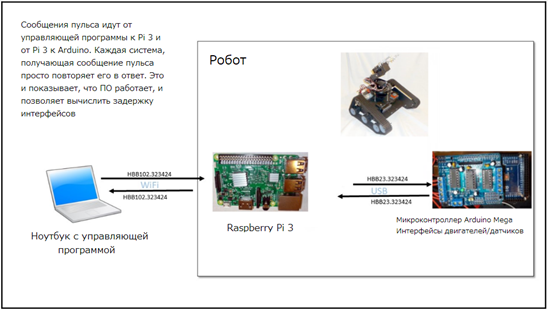

# Знакомство с роботом и средой разработки

Это книга о роботах и искусственном интеллекте, а значит, для всех практических примеров нам будет необходим робот. В дальнейшем, в Главе 2, мы обсудим, как я выбирал железо и софт для робота так, чтобы они были доступны среднестатистическому читателю. В Приложении я рассмотрел все компоненты, необходимые для робота, и показал, как соединять их между собой. Платформа и рука робота были куплены на AliExpress, вся электроника на Amazon.

Как видно на фото, у нашего робота есть гусеницы, механическая рука с шестью степенями свободы и компьютер. Давайте назовём его TinMan, ведь он, как и одноимённый персонаж \(Железный Дровосек\) из _Волшебника Страны Оз_, также имеет металлическое тело и хочет получить мозг.

Наши задачи в этой книге строятся вокруг поднятия игрушек в комнате, поэтому у робота есть прочная платформа с двумя двигателями и гусеницами для езды по ковру. Поворачивать он будет как танк, с помощью дифференциального привода, где для поворота мы посылаем разные команды на двигатели гусениц. Если мы хотим двигаться прямо - оба двигателя работают на одной скорости. Если мы хотим ехать назад - мы запускаем оба двигателя в обратном направлении на той же скорости. Повороты совершаются при движении одним двигателем вперёд, а вторым - назад, либо же движением в одну сторону, но при этом один двигатель работает на большей скорости, чем другой. С помощью этого мы можем совершать любые повороты. Для поднимания игрушек нужен какой-либо манипулятор, поэтому я добавил шестиосную руку, имитирующую комбинацию плечо-локоть-запястье. Она довольно ловкая и, т.к. сделана из стандартных цифровых приводов, её довольно легко установить и запрограммировать.

Вы заметите, что робот работает на одной батарейке. Возможно, Вам захочется поставить две - одну на компьютер, другую на двигатели. Это распространённая практика, у многих роботов есть раздельное питание. Главное - убедитесь, что заземление обеих систем соединено вместе. Я проверял свои источники питания аккуратно и у меня не возникло проблем с шумами или температурой, хотя я и не запускал руку и двигатели одновременно. Если же шумы от двигателей нарушают работу Arduino \(а Вы это узнаете, потому что Arduino будет постоянно перезапускаться\), Вы можете добавить небольшой конденсатор на 10мкФ, выполняющий роль фильтра шумов.

В качестве главного контроллера TinMan выступает одноплатный компьютер \(SBC\) Raspberry Pi 3, общающийся с оператором через встроенную сеть Wi-Fi. Контроллер Arduino Mega 2560, построенный на архитектуре Atmel предоставляет интерфейсы для моторов и датчиков робота.

Обратите внимание на предыдущую диаграмму внутреннего устройства робота. Нас больше всего волнует **одноплатный компьютер \(SBC\)** Raspberry Pi 3, мозг нашего робота. Остальные компоненты после первой установки не будут изменяться до конца книги.

Raspberry Pi 3 выступает в качестве главного интерфейса между пунктом управления, т.е. ПК с запущенной Linux, и роботом через Wi-Fi сеть. Любой маломощный SBC на базе Linux, такой как BeagleBone Black, Oodroid, XU4 или Intel Edison может справиться с этой задачей.

Подключенная к SBC плата Arduino 2560 Mega будет служить в качестве аппаратного интерфейса. Мы могли бы использовать и сам Pi, но при выделении Arduino нам не придется беспокоиться, что продвинутое ПО для ИИ, запущенное на Pi 3 будет мешать двигателям или сервоприводам. Т.к. наши двигатели требуют больше мощности, чем может позволить Arduino, нам пригодится регулятор мощности для усиления команд и достижения достаточной мощности для передвижения гусениц. Сервоприводы подключены напрямую к Arduino, но имеют отдельное подключение к источнику питания. Также нам понадобится 5В регулятор для предоставления подходящей мощности от 11.1В литиевой батарейки. В моём роботе батарейки установлены по схеме 3S1P \(три последовательно и одна параллельно\), всего 2700 А·ч. Как в случае с любыми литиевыми батарейками, соблюдайте полярность установки и перезаряжайте их в металлическом боксе или контейнере на случай возгорания.

